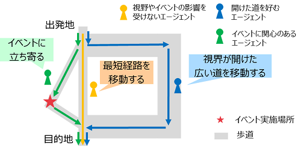
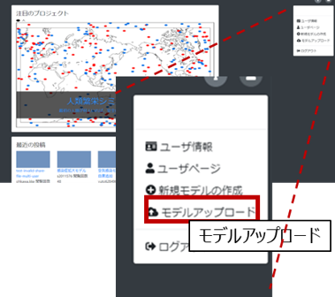
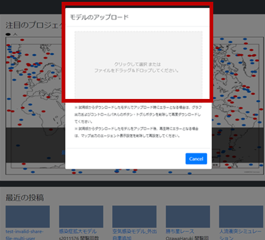
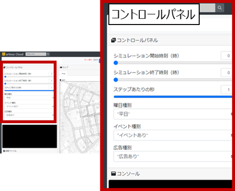
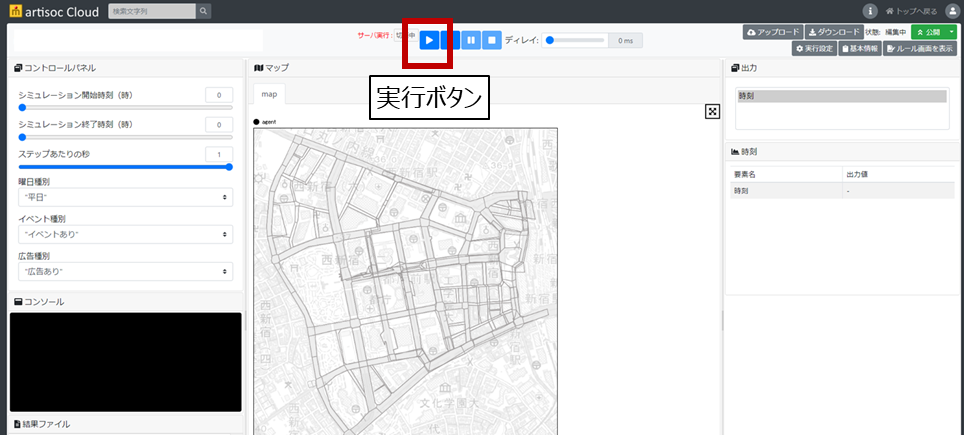
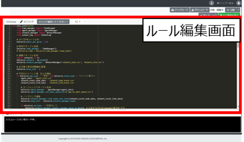

# 令和4年度 民間ユースケース開発　UC22-023「歩行者移動・回遊行動シミュレーション」の成果物

## 1. 概要
本リポジトリは、国土交通省民間ユースケース開発UC22-023「歩行者移動・回遊行動シミュレーション」における歩行シミュレーションに関するソースコードの利用方法及び説明となります。
このドキュメントでは、ユースケースの概要、歩行シミュレーションの概要、利用手順、注意事項等を記載しています。

## 2．「歩行者移動・回遊行動シミュレーション」について
### ユースケースの概要
近年、全国的に「人間中心のまちづくり」が志向されているなか、その実現のためにさまざまなまちづくり活動（エリアマネジメント）が実施されています。エリアマネジメントを効果的なものとするためには、都市空間・歩行者の行動特性を理解することが必要です。

今回の実証実験では、東京都西新宿エリアを対象として3D都市モデルを活用した歩行者行動シミュレーションを実施し、そのシミュレーション結果の分析と可視化によって、平常時・イベント実施時等におけるまちの賑わい創出のための施策の検討や検証を支援するツールを開発しました。

### 開発システムの概要
本リポジトリにあるソースコードは、ユースケースにおける歩行シミュレーションのソースコードとなります。
歩行シミュレーションの概要は次のとおりです。
#### 対象地区
東京都新宿区　西新宿地区
#### シミュレーション実施目的
- 対象地区における平常時（平日/休日）の人流の再現
- 対象地区においてイベント（2022年11月に実施された社会実験イベント「FUN MORE TIME SHINJUKU」を想定）が実施された際（平日/休日）の人流の変化の把握
	- イベント時の人流の変化の表現にあたっては、イベントの有無・イベントを宣伝する広告の有無を反映します。

#### 歩行シミュレーションアルゴリズム
- 基本的な考え方として、西新宿において幅員が広く上空が開けている道路や新宿駅直結の地下通路を通行している人が多い実態を踏まえ、通路の特性として幅員が広い空間や上空が開けている空間を歩行者が好んで選択するような経路選択モデルを作成しました。
- さらに、イベント時の人流の再現にあたって、平常時の経路選択モデルに加えて歩行者がイベント実施場所の周辺に近づいた際、西新宿における過去の社会実験の結果を参考した歩行者がイベントに立ち寄る割合に基づき、そのイベントに立ち寄るような経路変更を行うモデルを作成しました。
- 併せて、イベントを宣伝するような広告の設置を想定し、広告を見た歩行者がイベントへの興味を増し、イベント実施場所に近づくような経路変更を行うモデルを作成しました。

## 3．利用手順
利用手順として、インストール方法、インストール後の使い方、動作環境、前提ソフトウェアを記載します。

### インストール方法
1. 本リポジトリ内にあるファイル一式を、「Code」>「Download ZIP」からダウンロードします。

2. ダウンロードされた「PLATEAU-UC22-023-Pedestrian-Simulation-Model.zip」ファイルを解凍し、「model.json」ファイルを取得します。

3. artisoc Cloud(https://artisoc-cloud.kke.co.jp/) にアクセスします。

4. 右上の「ログイン」ボタンから、ログインを行います。

5. ログイン後、右上のボタンから「モデルをアップロード」を選択します。その後、モデルをアップロードできる画面に移るので、ドラッグ&ドロップにより、取得した「model.json」ファイルをアップロードしてください。

### 使い方
1. artisoc Cloudにモデルをインポート後、画面左上コントロールパネルから、シミュレーションの実行条件を設定します。具体的には、下記の項目を指定します。
- シミュレーション開始時刻（整数値）
- シミュレーション終了時刻（実数値）
	- 例えば、「8.1」を指定した場合、8時6分まで、「8.2」を指定した場合、8時12分までの実行となります。
- 1ステップあたりの秒数
	- 0.5秒/ステップ：シミュレーション内のエージェントがシミュレーション内の時間で0.5秒に1回計算、判断を行います。
	- 1秒/ステップ：シミュレーション内のエージェントがシミュレーション内の時間で1秒に1回計算、判断を行います。
	- 1ステップあたりの秒数を細かくするとエージェントの行動を細かく表現できますが、シミュレーション内の計算負荷が高くなるため、シミュレーションの実行時間が長くなります。
- イベント有無
	- イベントあり
	- イベントなし
- 曜日
	- 平日
	- 土日祝日
- 広告有無
	- 広告あり
	- 広告なし

2. シミュレーション実行条件を設定後、シミュレーション実行ボタンを押し、シミュレーションを実行します。

3. シミュレーション実行完了後、エージェントの行動ログ（csvファイル）が取得できます。

4. エージェントの行動ルールを変更したい場合は、トップ画面で「ルール画面の表示」を行い、ルール編集画面に移ります。

5. ルール編集画面に移るとpythonエディタが表示されるので、ルールを変更することが可能です。詳細は、artisoc Cloudマニュアル
(https://artisoc-cloud.kke.co.jp/documents/manual/index.html)
をご参照ください。

### 動作環境、前提ソフトウェア
本ソースコードの編集には、artisoc Cloud standardライセンス（有償）が必要です。
artisoc Cloud academicライセンス、playerライセンスでは動作しません。
シミュレーションの閲覧するのみの場合は、playerライセンスを登録のうえ、上記「使い方」に基づき、artisoc Cloudにアクセスのうえ、ご覧ください。閲覧のみの場合、シミュレーション結果をファイルとして取得することはできません。

## ライセンス <!-- 定型文のため変更しない -->
* ソースコードおよび関連ドキュメントの著作権は国土交通省に帰属します。
* 本ドキュメントは[Project PLATEAUのサイトポリシー](https://www.mlit.go.jp/plateau/sitepolicy/)（CCBY4.0および政府標準利用規約2.0）に従い提供されています。

## 注意事項 <!-- 定型文のため変更しない -->

* 本レポジトリは参考資料として提供しているものです。動作保証は行っておりません。
* 予告なく変更・削除する可能性があります。
* 本レポジトリの利用により生じた損失及び損害等について、国土交通省はいかなる責任も負わないものとします。

## 参考資料　 <!-- 各リンクは納品時に更新 -->
* 歩行者移動・回遊行動シミュレーション技術検証レポート: https://www.mlit.go.jp/plateau/libraries/technical-reports/
*  PLATEAU Webサイト Use caseページ「歩行者移動・回遊行動シミュレーション」: https://www.mlit.go.jp/plateau/use-case/
*  artisoc Cloud：https://mas.kke.co.jp/artisoccloud/
